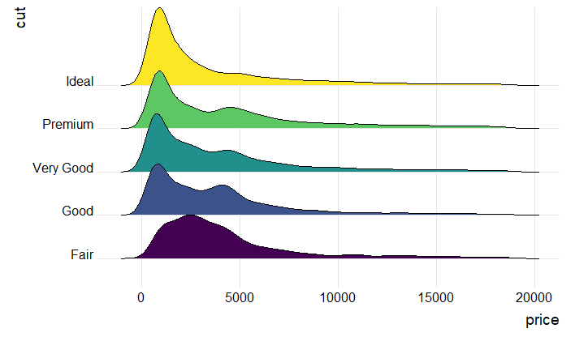
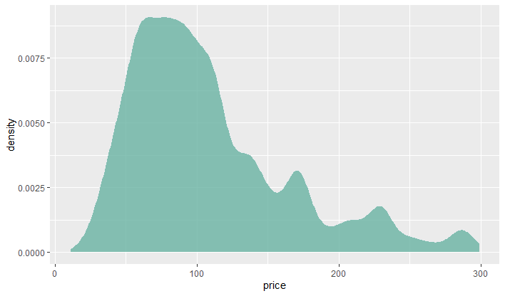
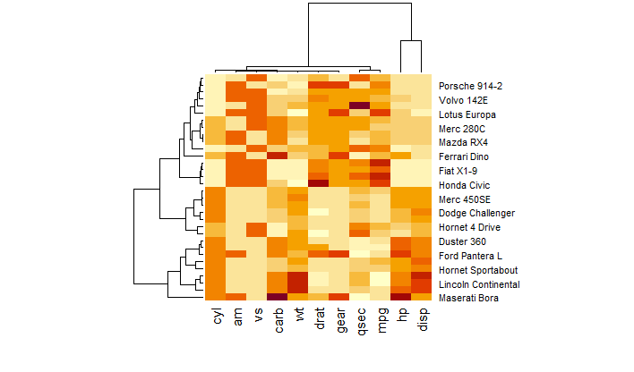
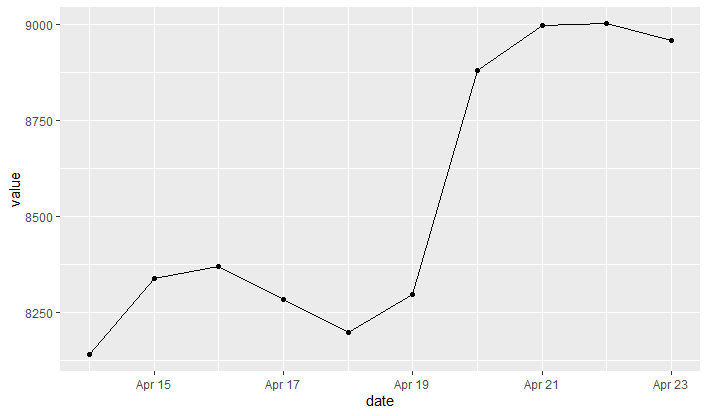
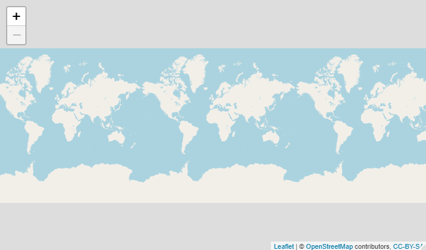

## Data Visualization
In this repository, different types of visualization will be performed on data using R and Python.

## Using R
### Chart 1: ridgeline plot: 
 - The ridgeline plot allows to study the distribution of a numeric variable for several groups.
 - 

### Chart 2: Basic density chart: 
 - A density plot is a representation of the distribution of a numeric variable. It is a smoothed version of the histogram and is used in the same kind of situation. 
 - 

### Chart 3: Heat Map: 
 - A heatmap is a graphical representation of data where the individual values contained in a matrix are represented as colors.
 - 

### Chart 4: Connected scatterplot: 
 - connected scatterplot is basically an hybrid between a scatterplot and a lineplot.
 - 

### Chart 5: Background map:
 - It explains how to build static and interactive maps based on different input data, but does not explain how to plot data on it.
 -  
  
-----------

For upcoming updates [Follow me](https://github.com/vijaypurohit322/).
